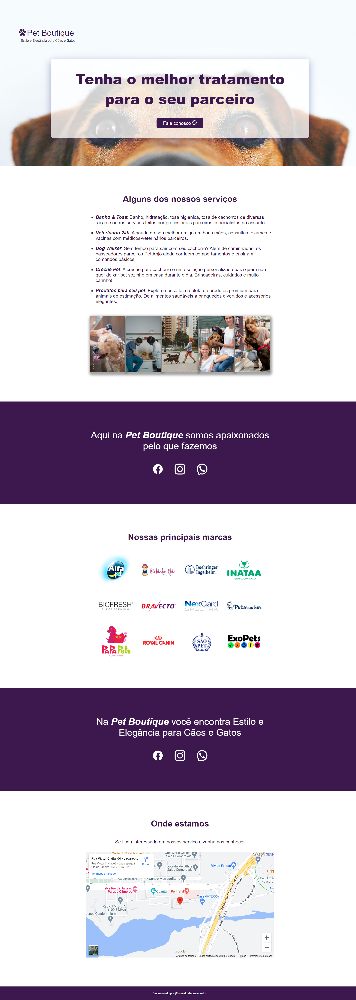

# 🚀 Página Pet Boutique
Esse projeto foi proposto no Guia de CSS da DevMedia, que tem como objetivo propor um projeto prático ao aluno para que ele pratique seus conhecimentos, sua mente programadora e ganhe autonomia.

## 🚀 Sobre o projeto
O projeto é uma página de divulgação de um petshop fictício. A página foi construída para praticar os conceitos de utilização de imagens de fundo com as propriedades de ```background``` do CSS.

## 🚀 Preview


## 🚀 Ferramentas Utilizadas
O projeto foi feito com HTML e CSS.